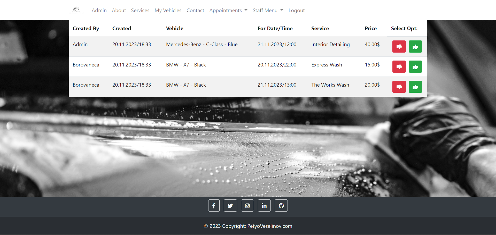

<a name="readme-top"></a>
# CarWash - Semi RESTful/Thymeleaf WEB Application.

<br />
<div align="center">
  <a href="https://github.com/Borovaneca/CarWash">
    
  </a>
    <h2>CarWash</h2>
  <p>
<!--     <a href="https://github.com/othneildrew/Best-README-Template">View Demo</a> -->
    <a href="https://github.com/Borovaneca/CarWash/issues">Report Bug</a>
    ·
    <a href="https://github.com/Borovaneca/CarWash/issues">Request Feature</a>
  </p>
</div>

<details>
  <summary>Table of Contents</summary>
  <ol>
    <li>
      <a href="#getting-started">Getting Started</a>
      <ul>
        <li><a href="#perequisites">Prerequisites</a>
        <li><a href="#installation">Installation</a></li>
      </ul>
    </li>
    <li>
      <a href="#about-the-project">About The Project</a>
      <ul>
        <li><a href="#built-with">Built With</a></li>
        <li><a href="#front-end">Front End</a></li>
        <li><a href="#back-end">Back End</a></li>
      </ul>
    </li>
    <li><a href="#usage">Usage</a>
      <ul>
        <li><a href="#admin">Admin</a></li>
      </ul>
      <ul>
        <li><a href="#manager">Manager</a></li>
      </ul>
      <ul>
        <li><a href="#employee">Employee</a></li>
      </ul>
      <ul>
        <li><a href="#registerDTO">Employee</a></li>
      </ul>
    </li>
    <li><a href="#rest-tests">REST Tests</a></li>
    <li><a href="#license">License</a></li>
  </ol>
</details>


## Getting Started

Please make sure you follow the steps, step by step!

### Prerequisites

* JDK 17
* Apache Maven 4.0.0+
* Depending on the features you want to use, you may need some third-party software, such as [DataGrip](https://www.jetbrains.com/datagrip/download/#section=windows) (payed) or [MySQL](https://dev.mysql.com/downloads/workbench/) Workbench (free) for data modeling, SQL development, and comprehensive administration for the system data.

### Installation

_In order to run CarWash you need to:_

1. <a href="https://github.com/Borovaneca/CarWash/archive/refs/heads/master.zip">DOWNLOAD</a> the repo.
2. Set up environment variables `${MYYSQL_PORT}, ${MYSQL_USER}.. etc...` 
   ```yaml
   spring.datasource.url: jdbc:mysql://localhost:${MYSQL_PORT}/carwash?allowPublicKeyRetrieval=true&useSSL=false&createDatabaseIfNotExist=true&serverTimezone=UTC
   spring.datasource.username: ${MYSQL_USER}
   spring.datasource.password: ${MYSQL_PASSWORD}
   admin.username: ${ADMIN_USERNAME}
   admin.password: ${ADMIN_PASSWORD}
   ```
3. Enjoy the application!

<p align="right">(<a href="#readme-top">back to top</a>)</p>

## About The Project


_The CarWash project is a Spring Boot-based application designed to streamline car cleaning services. It offers users the convenience of registering, managing their vehicles, and scheduling appointments for various car cleaning services._

### Built With

* 
* 
* 
* 
* 
* 
* 
* 
* 

### Front End

_Thymeleaf View Engine
Thymeleaf is utilized in this project for rendering dynamic HTML content by binding data from the backend to the frontend templates._

- [x] **Exception handling**
- [x] **Custom pages for the different types of exceptions**
- [x] **Data validity checks**
- [x] **Custom messages if some of the data is not valid**

### Back End

_The project incorporates a bit of Aspect-Oriented Programming (AOP) to modularize cross-cutting concerns._

* **Scheduled Tasks** :

1. **`Removing Inactive Users`**: Users who haven't confirmed their emails within 7 days are considered inactive and are automatically removed from the system.

2. **`Handling Rejected Appointments`**: Scheduled task to manage rejected appointments within the system.

---

* **Events Handling**

1. **`User Registration Activation Email`**: An event triggers the sending of an activation email upon registerDTO registration.
2. **`Password Reset Email`**: Another event allows users to reset their passwords if they forget them.
3. **`User Email Notification`**: Users will receive email notifications indicating whether the appointment has been accepted or rejected.

---

* **Mapping**

1. **`MapStruct`** - In this project, I employ [MapStruct](https://mapstruct.org/) to simplify the mapping between different types of objects, particularly between entity models and DTOs (Data Transfer Objects). MapStruct is a convenient and efficient code generation library that automates the process of mapping by generating mapping code during the compilation phase.

---

* **JWT Authentication**

Upon successful authentication, a JWT is generated and stored as an HTTP-only secure cookie in the browser. This token is used to authenticate.
- [x] *Expiration*: The token expires after 24 hours.
---
```
DEPRECATED
* **Cacheable Implementation**

Caching mechanisms are utilized within the application to improve performance by storing frequently accessed or computed data in temporary storage (cache). This reduces the need to repeatedly fetch or compute the same data, enhancing response times and overall system efficiency.

```
---

* **Proxy Pattern for Improved Performance and Data Storage**

The integration of the Proxy Pattern has significantly enhanced my project performance and provided a more efficient mechanism for data storage, replacing the previous caching system.

---

* **Multithreading**

In my project, Multithreading is instrumental in executing parallel operations efficiently, especially during cache updates within the Proxy Pattern. This utilization of Multithreading enhances the system's responsiveness and performance when refreshing cached information.

---

* **Custom Exceptions**

Custom exceptions are used to handle specific errors or exceptional cases in the application, improving error handling and providing meaningful feedback to users or clients.

---

* **Interceptor for Banned Users**

An interceptor is implemented to handle access control for banned users within the application. When a registerDTO attempts to access restricted resources or endpoints, this interceptor checks whether the registerDTO has been banned. If the registerDTO is identified as banned, access to the requested resource is denied.

---

* **Exception Handling**

Custom exception handling is implemented within the application to manage and respond to exceptional situations or errors that occur during the runtime of the system. These exceptions are designed to capture specific scenarios and provide appropriate responses to users or client applications.

---

* **Integration of External Services**

The project integrates with services like Cloudinary for managing and serving images.

---

* **Testing**
- [x] Junit
- [x] Mockito
- [x] GreenMail
- [x] HSQLDB
- [x] Integration tests

The project includes JUnit and Mockito for unit testing and integration tests with inmemory database, ensuring the reliability and correctness of various components within the application.
This structure provides a clear and organized overview of both the frontend and backend aspects of the project, detailing the technologies, functionalities, and methodologies utilized. Adjust the descriptions as needed to accurately represent the specifics of your project.

<p align="right">(<a href="#readme-top">back to top</a>)</p>

## Usage
_Here you can find all the information about the roles in the applicaтion and what they can do._

### Admin

_Only the users with role Admin can change others users roles ban them!_


### Manager

_This role has the authority to approve/decline the appointments requested by users._



### Employee

_The role of the Employee is basically a permission to see the approved appointments by the manager, wich are for the current day!_


<p align="right">(<a href="#readme-top">back to top</a>)</p>

## REST Tests

* Request:
```
GET http://localhost:8080/api/owner/users/all
```
* Response:
```json
[
    {
        "id": "1",
        "locatedOn": "https://statusneo.com/wp-content/uploads/2023/02/MicrosoftTeams-image551ad57e01403f080a9df51975ac40b6efba82553c323a742b42b1c71c1e45f1.jpg",
        "username": "Admin",
        "email": "borovaneca@softuni.bg",
        "role": "OWNER",
        "age": "23",
        "registeredOn": "2023-11-20",
        "isBanned": "No"
    },
    {
        "id": "2",
        "locatedOn": "http://res.cloudinary.com/dy2y8i2de/image/upload/v1700497506/f0b394ae-ac21-449f-8c48-2281b8417aa0.png",
        "username": "Borovaneca",
        "email": "boroto_vr@abv.bg",
        "role": "USER",
        "age": null,
        "registeredOn": "2023-11-20",
        "isBanned": "No"
    },
    {
        "id": "3",
        "locatedOn": "http://res.cloudinary.com/dy2y8i2de/image/upload/v1700502854/4dbb9200-b048-4790-9c6d-2db5ec94be7d.png",
        "username": "PetyoVeselinov",
        "email": "borovaneca@virgilio.it",
        "role": "USER",
        "age": null,
        "registeredOn": "2023-11-20",
        "isBanned": "No"
    },
    {
        "id": "4",
        "locatedOn": "http://res.cloudinary.com/dy2y8i2de/image/upload/v1700502883/ac334b18-74f8-44dd-8e9f-51d606049e4a.png",
        "username": "Petyo",
        "email": "borovaneca@abv.bg",
        "role": "USER",
        "age": null,
        "registeredOn": "2023-11-20",
        "isBanned": "No"
    }
]
```

* Request:
```
POST http://localhost:8080/api/owner/users/ban/4
```
* Response:
```json
{
   "id=""4",
   "locatedOn=""http://res.cloudinary.com/dy2y8i2de/image/upload/v1700502883/ac334b18-74f8-44dd-8e9f-51d606049e4a.png",
   "username=""Petyo",
   "email=""borovaneca@abv.bg",
   "role=""USER",
   "age=""null",
   "registeredOn=""2023-11-20",
   "isBanned=""true"
}
```
<p align="right">(<a href="#readme-top">back to top</a>)</p>

## License
<center><details>
<summary>Click to read the MIT License</summary>

<div style="overflow-x: auto; max-height: 300px;">
  
  <center>  # MIT License

Copyright (c) 2023 Petyo Veselinov

Permission is hereby granted, free of charge, to any person obtaining a copy
of this software and associated documentation files (the "Software"), to deal
in the Software without restriction, including without limitation the rights
to use, copy, modify, merge, publish, distribute, sublicense, and/or sell
copies of the Software, and to permit persons to whom the Software is
furnished to do so, subject to the following conditions:

The above copyright notice and this permission notice shall be included in all
copies or substantial portions of the Software.

THE SOFTWARE IS PROVIDED "AS IS", WITHOUT WARRANTY OF ANY KIND, EXPRESS OR
IMPLIED, INCLUDING BUT NOT LIMITED TO THE WARRANTIES OF MERCHANTABILITY,
FITNESS FOR A PARTICULAR PURPOSE AND NONINFRINGEMENT. IN NO EVENT SHALL THE
AUTHORS OR COPYRIGHT HOLDERS BE LIABLE FOR ANY CLAIM, DAMAGES OR OTHER
LIABILITY, WHETHER IN AN ACTION OF CONTRACT, TORT OR OTHERWISE, ARISING FROM,
OUT OF OR IN CONNECTION WITH THE SOFTWARE OR THE USE OR OTHER DEALINGS IN THE
SOFTWARE.</center>
</div>

</details></center>


<p align="right">(<a href="#readme-top">back to top</a>)</p>
